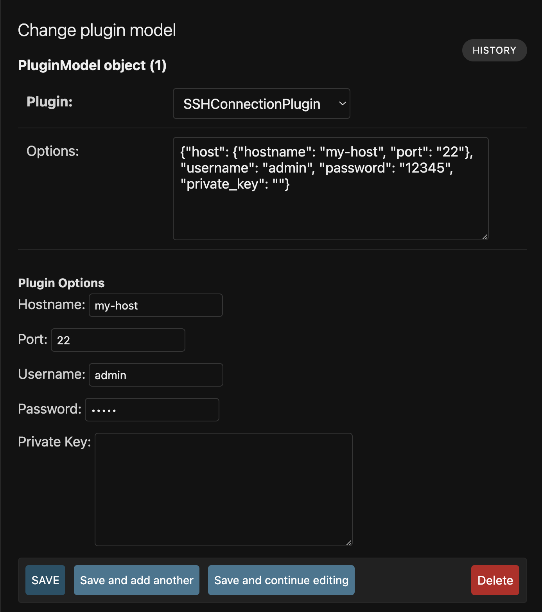

# Django Admin with plugins and custom forms

## Description
The aim of this project is to develop a proof of concept for a configurable plugin system that allows the creation of entries in the django admin interface, each entry is defines the plugin and some options. The options are used to generate a form with the fields defined in the plugin. The plugin can also define custom validation methods.


## Features
- Dynamic form generation based using standard django form fields.
- Nested objects support.
- Custom validation methods.

# TODO
- [ ] Add support for custom form fields.
- [ ] Add support for array fields.
- [ ] Improve nested fields support.
- [ ] Make it an installable library.
- [ ] Write unit tests.

## Installation
1. Clone the repository:
    ```bash
    git clone https://github.com/yourusername/advanced_admin.git
    ```
2. Navigate to the project directory:
    ```bash
    cd django_admin_plugin_with_custom_forms
    ```
3. Install the dependencies:
    ```bash
    pip install -r requirements.txt
    ```
4. Apply the migrations:
    ```bash
    python manage.py migrate
    ```

## Example
The following is an example of a plugin that generates a form with nested fields. The form includes a custom validation method that checks if either the password or the private key is provided.


```python
# example plugin
class SSHConnectionPlugin:
    @staticmethod
    def get_form():
        class SSHConnectionForm(BasePluginForm):
            host__hostname = forms.CharField(label="Hostname", max_length=100)
            host__port = forms.IntegerField(label="Port", initial=22)
            username = forms.CharField(label="Username", max_length=100)
            password = forms.CharField(label="Password", widget=forms.PasswordInput, required=False)
            private_key = forms.CharField(label="Private Key", widget=forms.Textarea, required=False)

            def plugin_clean(self, data) -> Dict[str, str] | None:
                password = data.get('password')
                private_key = data.get('private_key')

                errors = {}
                if not password and not private_key:
                    errors['password'] = 'Either password or private key is required.'

                return errors if errors else None

        return SSHConnectionForm

    def __init__(self, options):
        host = options.get('host')
        if not host:
            raise ValueError("Host is required.")
        
        self.hostname = host.get('hostname', None)
        self.port = host.get('port', None)

        self.username = options.get('username')
        self.password = options.get('password')
        self.private_key = options.get('private_key')

    def download(self, remote_path, local_path):
        # Connect to the SSH server using the provided credentials
        pass
```

Example JSON data:
```json
{
    "host": {
        "hostname": "my-host",
        "port": "22"
    },
    "username": "admin",
    "password": "12345",
    "private_key": ""
}
```



